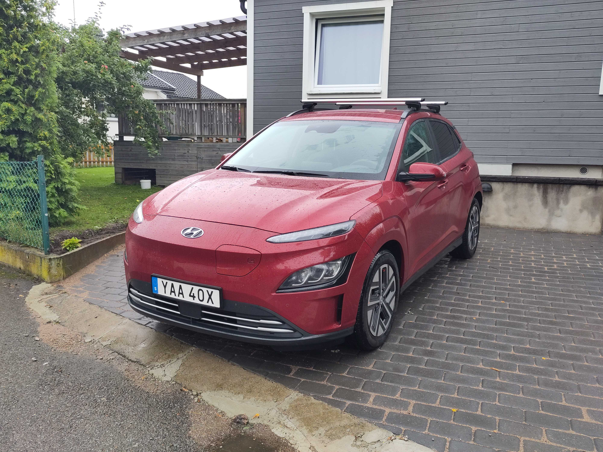
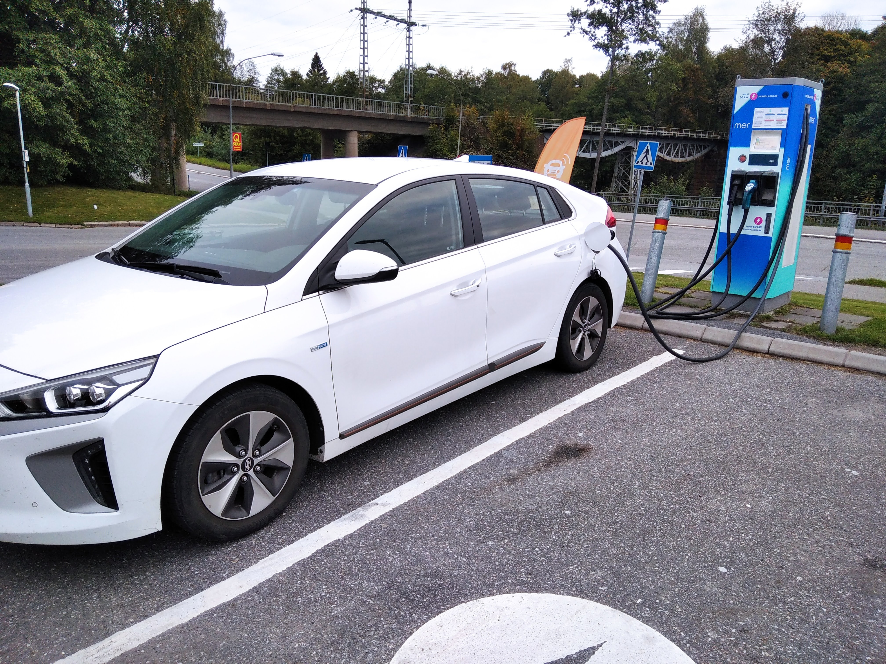
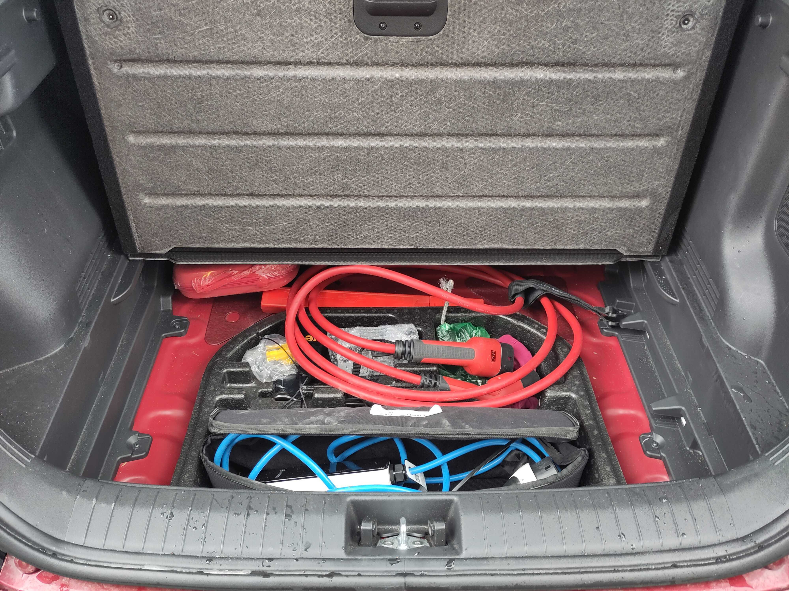
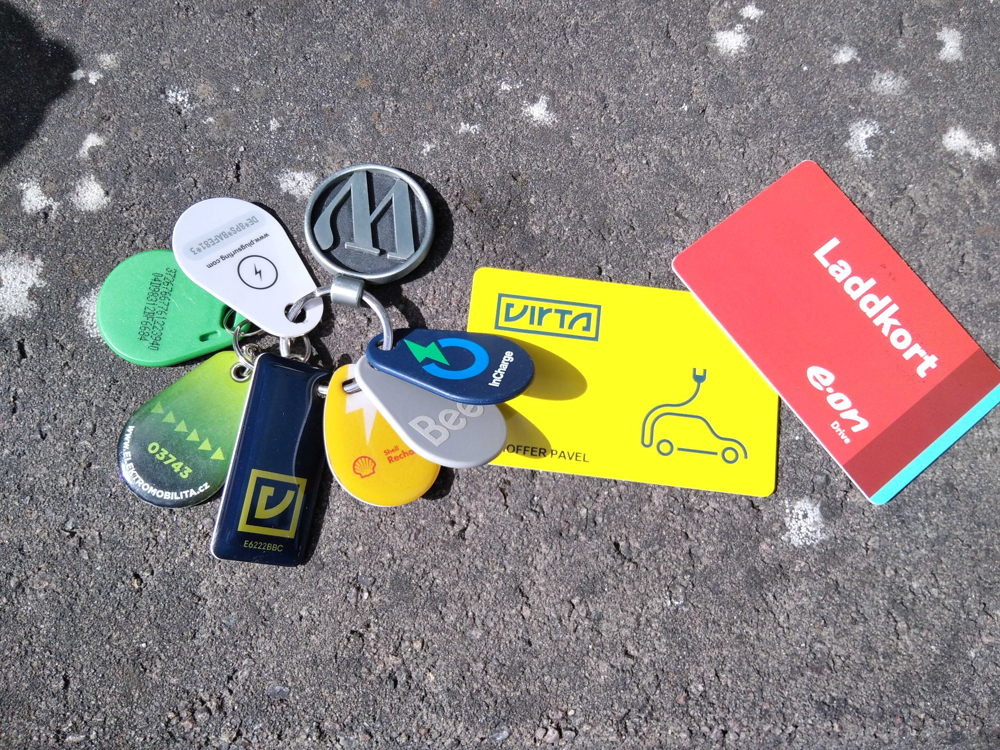

## Hyundai Kona Electric

How cool is it, that you decided to share electric car via [GoMore](https://gomore.se/hyrbil/520843) ?! :)

### Car info

Fully electric great car. Meaning it is great fun to drive and you can save a lot on energy costs. The back seats are fully foldable to create a nice platform to move furniture. The car does NOT have a hitch for a trailer though.

It has quite big baterry of 64kwh also it is quite efficient electric car. So it do around 450km depending on conditions.

There are some more [stats](https://evcompare.io/cars/hyundai/hyundai-kona-electric-64-kwh/?units=metric) you can check if you are interested.

### Charging - Types

In most cases I will try to borrow the car with close to full batery. If you would return the car bellow 70% of charge please let me know in advance.

To charge the car you have 3 options:

#### Fast charging / DC charging

This is the option you will probably use the most. The connector is called **CCS** and the cable is attached to the charging station.

It takes 40-60 minutes. It only charges to 94%. The charging speed **changes** throughout the session. The max _paper_ speed is 77 kwh, it only can achieve anything that sub 80% then it slows down. It also depends on the temperature outside and of the battery. There is no simple way for you to influence the speed, the car will choose as high as it and the charging station can handle.

The most common type of fast chargers are 50kwh ones. The faster ones will get the job done a bit faster, but then you are limited by the speed of the car as described above.

_Note: Tesla chargers have the right connector (CCS) and they are currently running a pilot where many (not all though) of them are usable to non-tesla too via their app_

#### Type 2

This is a shopping-mall option:) It is too slow to use during a longer trip, but many shopping malls or towns have public free charging of this type. The charger boxes are usually quite small. It takes few hours to charge the car this way. Also it is a good trick to get very good parking slot.

The cable for this is in trunk bellow the cover. It is the red cable.

#### Regular power outlet

The most convenient option if you have the car for multiple days and have access to outdoors outlet. The cable is in the trunk in the same place type 2 cable is. It is blue one inside a box.

It takes quite a lot of time though (24 hours) so it is only really a viable option overnight or as an emergency.

### Charging - Apps

In general charging stations don't have a way to pay on the spot. You are suppose to use an app connected to that network, create an account with your card and then use it through the app. There are several networks of chargers and each has different app. It is kinda mess...

Alternative to an app is an RFID chip, that you can most of the time order from each network (sometimes free, sometimes for a fee). I leave mine RFID chips in the glovebox. They are connected to my card, but in case of emergancy when the app would not be able to connect to the station or there is no signal, you can use those.

- [PlugSurf](https://www.plugshare.com/) - This is the app that lists all the possible places to charge. It has smart filters. You can put in the make of the car and only avaiable chargers will show up. This is what I use to plan my trips. Chrgers are community sourced and reviewed so the review will help you estimate if there is any risk of the charger not working.
- [A Better Route Planner](https://abetterrouteplanner.com/) - an app to plan longer trips
- [E.on drive](https://play.google.com/store/apps/details?id=se.eon) - This is the network I use the most. There is a discount if you have electricity with E.on and you enter that when setting up account
- [Mer](https://no.mer.eco/) - Also pretty good/cheap network that is all over.
- [Shell Recharge](https://play.google.com/store/apps/details?id=com.thenewmotion.thenewmotion) - This is one of the more successful attempts of unifying charging networks. One app works on many networks, but it can be slightly more expensive than using the network directly.

### 404 information not found!

Did I miss something? Please let me know so I can update this page.
